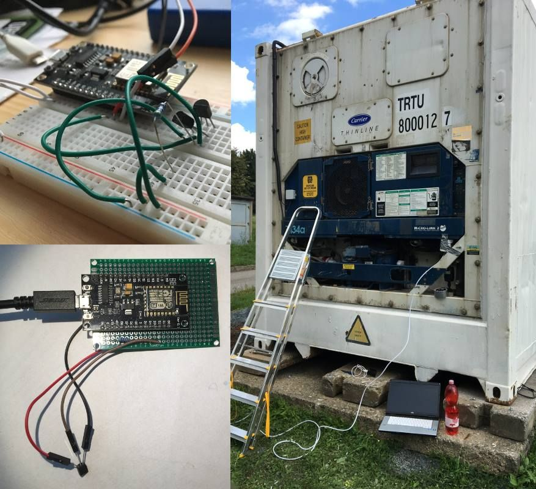
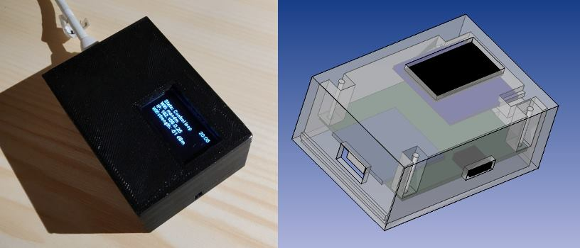

Packaging
=========

Phase 1 - no boxes
------------------
At the very beginning, a bare chip was inserted into plastic box and fixed to cargo using silver dug tape. There were no peripherals except one Dallas sensor.

Phase 2 - PLA box
-----------------
Chip is boxed in box printed on 3D printer from PLA plastic. LCD display was added showing various run time information (e.g. wifi connection status, temperatures from all sensors). Cables from sensors are connected to Dupont female connectors soldered on board and available through holes on side of the plastic box. Refer to `boxes` directory for FreeCAD sources of all boxes.

Phase 3 - TODO
--------------
- prepare box (3D printing) for standard board size (4x6cm)
- if the display is part of the device, it should be attached via dupont cables instead hard soldering
- assemble first prototype with connector for Dallas sensors
