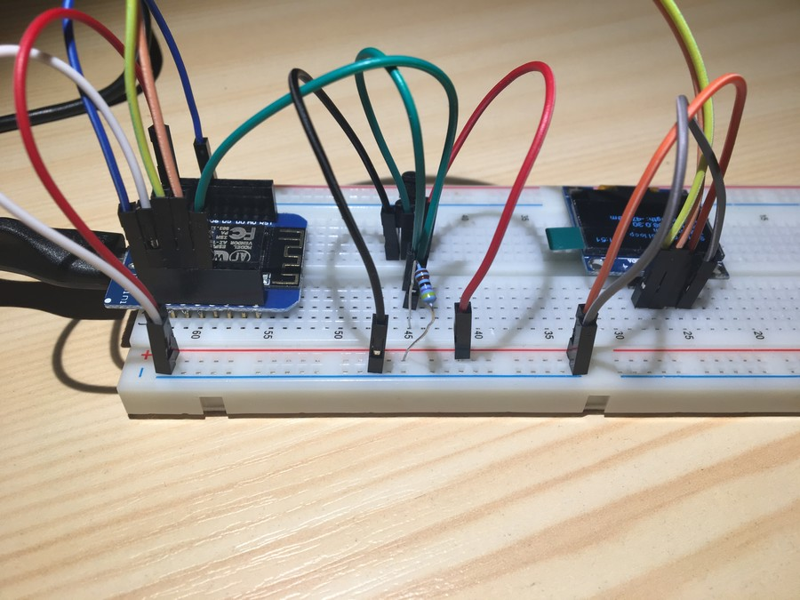
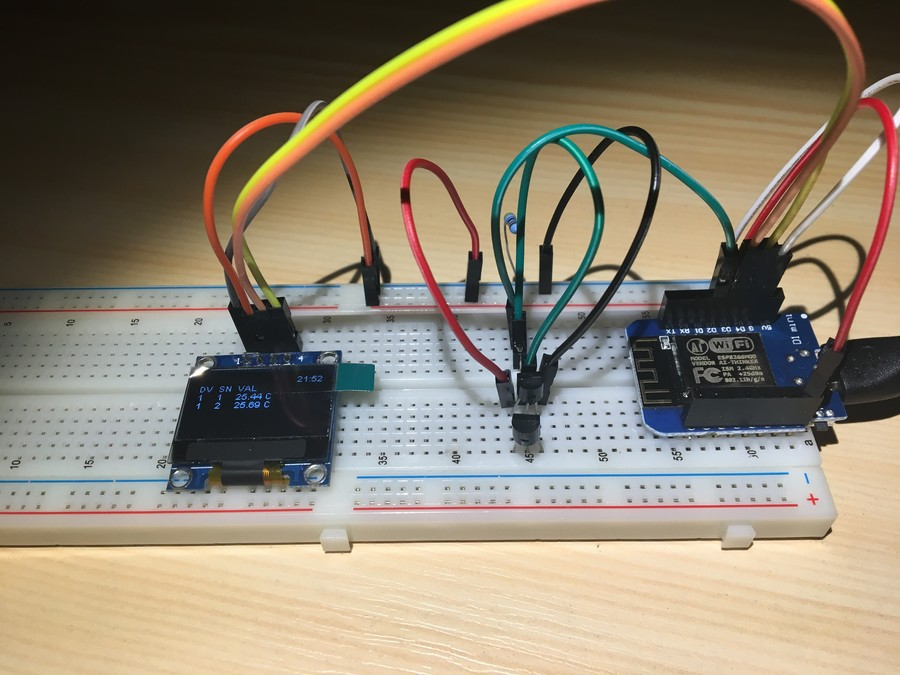
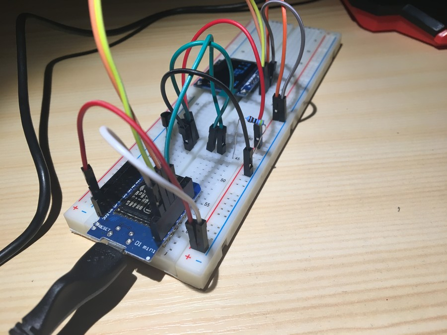
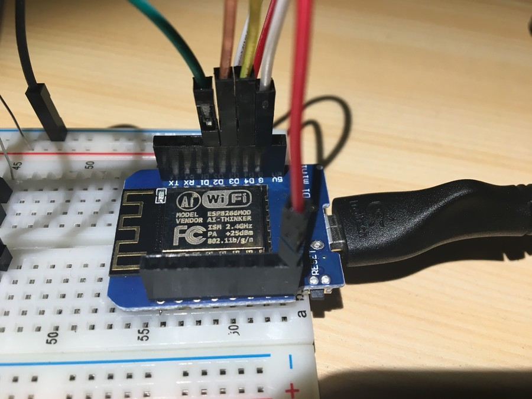
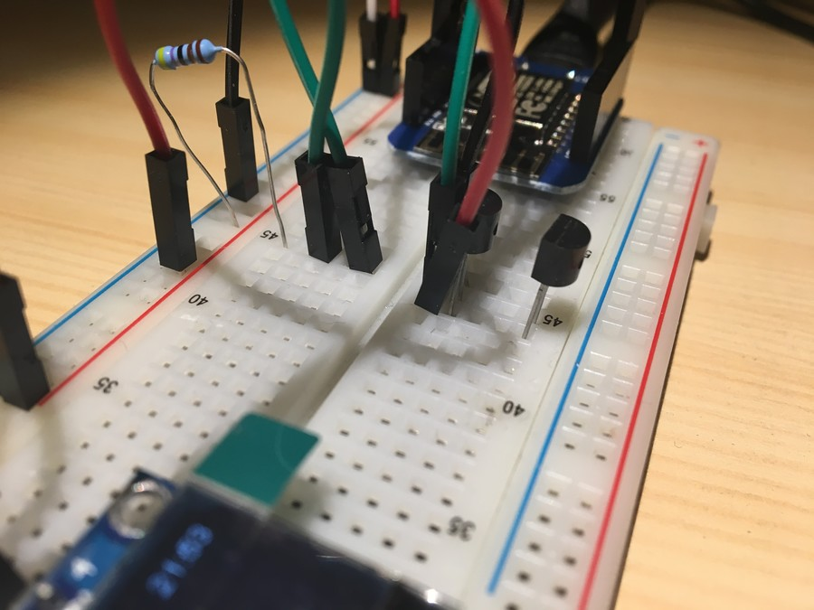
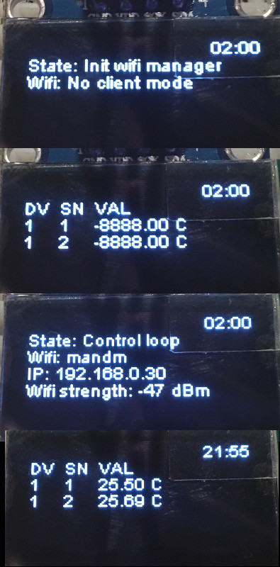

Wiring
======

Example 1 - D1 Mini + Dallas + OLED 
-----------------------------------

Dallas sensors are connected to D2, OLED to D3 and D4

Screenshots of display after Wifi provisioning - temperature from two sensors
is shown as well as wifi connection information and current time (fetched from
internet via NTP).

